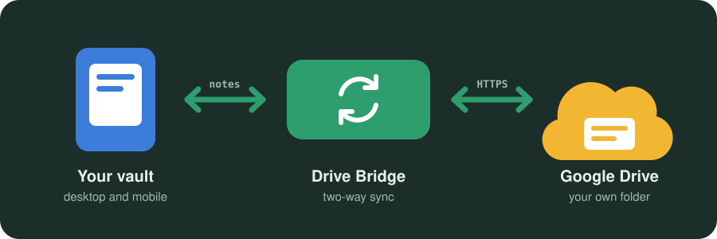

# Drive Bridge

Two-way sync between your Obsidian vault and Google Drive, on desktop and on
iPhone and iPad. Built for a folder that other apps write to as well: an AI
assistant dropping notes in, a backup server reading them out.

- **No telemetry, no tracking.** Nothing about you, your notes or how you use
  Drive Bridge is ever sent to the author or any third party.
- **Your files go only between your device and your own Google Drive,**
  through your own Google client. No server of ours in between, and no code
  downloaded at runtime.

> [!WARNING]
> **Back up your vault before you use Drive Bridge.** Sync can delete or
> overwrite files on both sides, so keep a copy you can restore from.

## How it fits together

Drive Bridge keeps your vault and one Google Drive folder in step, on every
device you install it on. Unlike plugins that only see the files they created,
it sees everything in the folder, so notes other tools write (an AI assistant,
a script, a teammate) show up like any other note. How they get into the folder
is up to them and Drive's sharing settings. Seeing more also means more can go
wrong, so safety comes first.

## Features

[Two-way sync](FEATURES.md#two-way-sync) ·
[Sees every file](FEATURES.md#sees-every-file) ·
[Nothing silently lost](FEATURES.md#nothing-silently-lost) ·
[Easy setup](FEATURES.md#easy-setup) ·
[Recovers on its own](FEATURES.md#recovers-on-its-own) ·
[Private by design](FEATURES.md#private-by-design)

## Install

Drive Bridge is not in Community plugins yet. Until it is, install it with
[BRAT](https://github.com/TfTHacker/obsidian42-brat) by adding
`mmayadag/drive-bridge` as a beta plugin; the steps are in
[TECHNICAL.md](TECHNICAL.md#install).

## Set up

1. Create a Google Cloud OAuth client (Desktop app) with the Drive API enabled.
2. On each device, open **Google account** in Drive Bridge settings, enter the
   client ID and secret, press **Sign in with Google**, and paste back the
   address the browser ends on. No terminal needed; a token from rclone works
   too.
3. Pick a Drive folder and run your first sync.

Step-by-step instructions and the reasoning behind each choice are in
[TECHNICAL.md](TECHNICAL.md#setup).

## Privacy

The only requests Drive Bridge makes are to Google, and to a webhook URL if you
set one yourself. It collects no usage statistics, has no analytics or crash
reporting, and writes to the clipboard only when you press a copy button.
Details in [PRIVACY.md](PRIVACY.md).

## Support

If the plugin saves you a headache, you can buy me a coffee. Contributions of
code and bug reports are welcome too, see
[CONTRIBUTORS.md](CONTRIBUTORS.md).

Drive safe :)&nbsp;&nbsp;

## License

[MIT](LICENSE)

## Author

Murat Mayadağ
