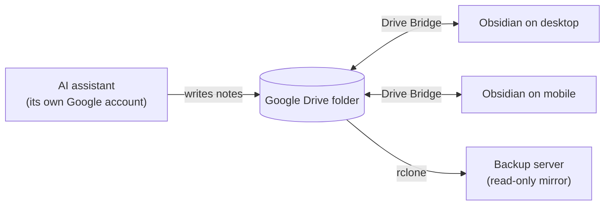

# Drive Bridge

  
   

Two-way sync between your Obsidian vault and Google Drive, built for a folder
that other apps write to as well: an AI assistant dropping notes in, a backup
server reading them out.

> **Status:** early. The full round trip works on macOS: connecting, picking a
> Drive folder, and notes moving both ways. iOS is not tested yet, and no one
> has run this against a large vault. Keep a backup.

## How it fits together

The Drive folder is the meeting point. Drive Bridge keeps each device in step
with it, and because the plugin can see everything in that folder, a note an
assistant drops there arrives in your vault like any other note. Who may write
where is decided by Google Drive's own sharing permissions, not by the plugin.

## Why

Most Drive plugins only see the files they created themselves. Drive Bridge
sees everything in its folder, so notes written by other tools (an AI
assistant, a script, a teammate) show up in your vault like any other note.

Seeing more also means more can go wrong, so safety comes first:

- **Nothing is silently lost.** Conflicting edits are merged or kept side by
  side, never overwritten.
- **Deletes are confirmed.** Remote deletions ask before touching your vault.
- **No remote code.** Everything the plugin runs is in this repository.
- **Your credentials stay yours.** Bring your own Google Cloud client; the
  refresh token lives in the OS keychain, not in synced files.

## Install

Drive Bridge is not in the community store. Install it with
[BRAT](https://github.com/TfTHacker/obsidian42-brat):

1. Install and enable BRAT.
2. BRAT → **Add beta plugin** → `https://github.com/mmayadag/drive-bridge`
3. Enable **Drive Bridge** in Community plugins.

## Set up

1. Create a Google Cloud OAuth client (Desktop app) with the Drive API enabled.
2. Get a refresh token once with
   `rclone authorize "drive" <client ID> <client secret>`.
3. On each device, enter the client ID, secret and token in Drive Bridge
   settings, pick a Drive folder and run your first sync.

Step-by-step instructions and the reasoning behind each choice are in
[TECHNICAL.md](TECHNICAL.md#setup).

Drive safe :)

## Privacy

Your notes stay between this device and your own Google Drive. The plugin uses
your own OAuth client, downloads no code at runtime, and sends your files
nowhere else. It collects no usage statistics and contains no analytics: the
only requests it makes are to Google, and to a webhook URL if you set one
yourself. Details in [PRIVACY.md](PRIVACY.md).

## Support

If the plugin saves you a headache, you can buy me a coffee. Contributions of
code and bug reports are welcome too, see
[CONTRIBUTORS.md](CONTRIBUTORS.md).

## License

[MIT](LICENSE)

## Author

Murat Mayadağ
