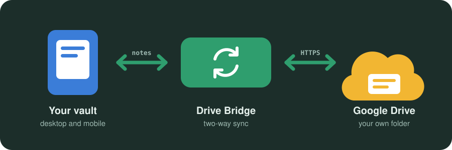

# Drive Bridge

Two-way sync between your Obsidian vault and a Google Drive folder, on desktop
and mobile. Unlike plugins that only see the files they created, Drive Bridge
picks up every file in the folder, so notes from other apps, AI assistants,
scripts or teammates show up like any other note.

- Nothing silently lost: conflicting edits are merged or kept side by side, and
  large deletions stop and ask.
- Your own Google OAuth client: files move only between your device and your
  Google Drive, with no server in between.
- No telemetry, no analytics and no code downloaded at runtime.

> [!WARNING]
> **Back up your vault first.** Two-way sync can overwrite or delete files on
> either side.

## How it fits together

Drive Bridge keeps your vault and one Google Drive folder in step, on every
device you install it on. How other tools get notes into the folder is up to
them and Drive's sharing settings. Seeing more also means more can go wrong, so
safety comes first.

## Features

[Two-way sync](FEATURES.md#two-way-sync) ·
[Sees every file](FEATURES.md#sees-every-file) ·
[Nothing silently lost](FEATURES.md#nothing-silently-lost) ·
[Easy setup](FEATURES.md#easy-setup) ·
[Recovers on its own](FEATURES.md#recovers-on-its-own) ·
[Private by design](FEATURES.md#private-by-design)

## Install

Install Drive Bridge from the
[Obsidian Community directory](https://community.obsidian.md/plugins/drive-bridge),
or in Obsidian: **Settings → Community plugins → Browse**, search for
**Drive Bridge**, then **Install** and **Enable**.

To try pre-releases before they reach the directory, use
[BRAT](https://github.com/TfTHacker/obsidian42-brat); the steps are in
[TECHNICAL.md](TECHNICAL.md#install).

## Set up

1. Create a Google Cloud OAuth client (Desktop app) with the Drive API enabled.
2. On each device, open **Google account** in Drive Bridge settings, enter the
   client ID and secret, press **Sign in with Google**, and paste back the
   address the browser ends on. No terminal needed; a token from rclone works
   too.
3. Pick a Drive folder and run your first sync.

Step-by-step instructions and the reasoning behind each choice are in
[TECHNICAL.md](TECHNICAL.md#setup).

## Privacy

The only requests Drive Bridge makes are to Google, and to a webhook URL if you
set one yourself. It collects no usage statistics, has no analytics or crash
reporting, and never touches the clipboard. Setup links to the Google Cloud
Console, GitHub and the coffee page open in your browser; the plugin sends
nothing to them. Details, including every address the plugin calls, in
[PRIVACY.md](PRIVACY.md).

## Support

If the plugin saves you a headache, you can star it on GitHub or buy me a
coffee. The settings link to both at the bottom; they open in the browser and the
plugin sends nothing. Contributions of code and bug reports are welcome too, see
[CONTRIBUTING.md](CONTRIBUTING.md).

Drive safe :)&nbsp;&nbsp;

## License

[MIT](LICENSE)

## Author

Murat Mayadağ
