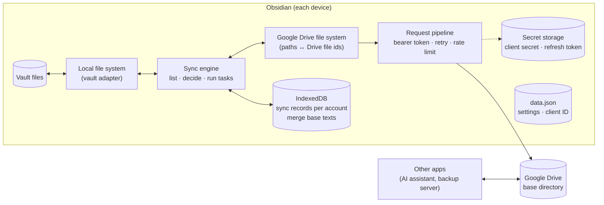
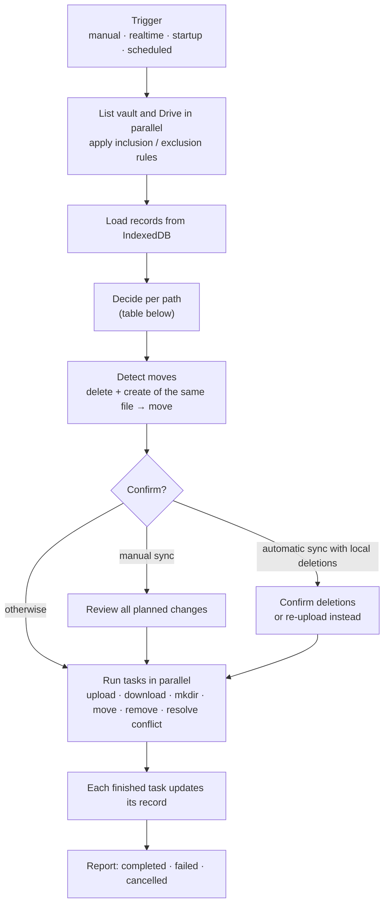

# Drive Bridge technical notes

## Install

Drive Bridge is not in Community plugins yet. Install it with
[BRAT](https://github.com/TfTHacker/obsidian42-brat):

1. Install and enable BRAT from Community plugins.
2. BRAT → **Add beta plugin** → `https://github.com/mmayadag/drive-bridge`.
3. Enable **Drive Bridge** in Community plugins.

BRAT installs the files attached to the latest GitHub release and can keep
them updated.

## Setup

Do steps 1 and 2 once, then step 4 on every device. Step 3 is only needed if
you prefer a terminal or want a token for another tool.

### 1. Pick a Google account

Use a Google account dedicated to this vault, not your personal one. Drive
Bridge asks for full Drive access (see [below](#why-the-full-drive-scope)), so
a leaked token would expose everything in that account's Drive.

### 2. Create an OAuth client in Google Cloud

Sign in to [Google Cloud Console](https://console.cloud.google.com) with that
account. The Google account page in Drive Bridge lists the same four steps,
each with a button to its Console page.

1. **Create a project**: project picker → **New project**. Any name works.
2. **Enable the Drive API**: **APIs & Services → Library**, search for
   **Google Drive API**, open it and press **Enable**.
3. **Configure the consent screen**: **Google Auth Platform → Branding**. Fill
   in an app name (for example _Drive Bridge_) and your email as support and
   developer contact. Save.
4. **Set the audience**: **Google Auth Platform → Audience**. Choose
   **External**, then press **Publish app** so the status reads
   **In production**. In _Testing_ status refresh tokens expire after 7 days
   and sync stops.
5. **Create the client**: **Google Auth Platform → Clients → Create client**.
   Application type **Desktop app**, any name. Copy the **client ID** and
   **client secret**, or download the client's JSON: pasting the whole JSON
   into the client ID field fills in both.

You do not need to submit the app for verification. It is only used by you.

### 3. Get a refresh token (optional)

**Sign in with Google** on the Google account page (step 4) does this for you,
on desktop and on phones. The methods below end with the same kind of token
and are useful if you want one token for every device, or for rclone on a
backup server.

In every method Google warns that the app is not verified. Press
**Advanced → Go to \<app name\> (unsafe)**: it is your own client, so the
warning is expected.

Treat the result like a password. Anyone holding it together with the client
ID and secret can read and change the whole Drive of that account.

#### Method 1: rclone (simplest)

On a computer with [rclone](https://rclone.org/downloads/) installed:

```bash
rclone authorize "drive" "<client ID>" "<client secret>"
```

A browser opens; sign in with the account from step 1 and approve. rclone then
prints the token between `Paste the following into your remote machine --->`
and `<---End paste`. Recent versions print a long string starting with `eyJ`,
older ones a JSON object; Drive Bridge accepts either.

`"drive"` without further options asks for the full `drive` scope, which is
what Drive Bridge needs. The same token also works as the remote for a backup
server running rclone.

#### Method 2: browser and curl (no rclone)

1. Open this URL in a browser, with your client ID filled in:

   ```
   https://accounts.google.com/o/oauth2/v2/auth?client_id=<client ID>&redirect_uri=http://127.0.0.1:53682&response_type=code&scope=https://www.googleapis.com/auth/drive&access_type=offline&prompt=consent
   ```

2. Approve access. The browser then fails to load a `127.0.0.1` page, and that is
   expected, nothing is listening there. What matters is the address bar:

   ```
   http://127.0.0.1:53682/?code=4/0AX4...&scope=https://www.googleapis.com/auth/drive
   ```

3. Copy the value of `code=` (everything up to the next `&`).
4. Exchange it for a token, within a few minutes:

   ```bash
   curl -s https://oauth2.googleapis.com/token \
     --data-urlencode "client_id=<client ID>" \
     --data-urlencode "client_secret=<client secret>" \
     --data-urlencode "code=<the code>" \
     --data-urlencode "grant_type=authorization_code" \
     --data-urlencode "redirect_uri=http://127.0.0.1:53682"
   ```

5. The response is JSON containing `refresh_token`. Paste the whole response,
   or just that value, into Drive Bridge.

`access_type=offline` and `prompt=consent` are what make Google return a
refresh token; without them you only get an access token that expires in an
hour.

#### Method 3: reuse a token you already have

A refresh token is not tied to a device. If you already connected one device,
or set up a backup server with rclone using the same client, that token works
everywhere. Copy it from the other machine's `rclone.conf` instead of creating
a new one.

Google allows up to 100 live refresh tokens per client and account; creating
the 101st quietly invalidates the oldest. Reusing one token avoids ever
thinking about that limit.

### 4. Connect each device

In Obsidian, install Drive Bridge (see [Install](#install)), then open
**Settings → Drive Bridge**.

If another device is already set up, export its settings there (Advanced →
**Export settings**, with _Include the Google account_ and a passphrase), and
on this device press **Set up from another device** on the Google account
page, paste the export and enter the passphrase. That covers everything
below. Otherwise:

1. Open **Google account** under Google Drive (it reads _Tap to connect_ or _Click to connect_) and
   paste the **OAuth client ID** (or the downloaded client JSON). A client ID
   that does not look like `….apps.googleusercontent.com` is outlined.
2. On the same page, paste the **OAuth client secret**. It is stored in the
   device's secure storage, not in synced files.
3. Press **Sign in with Google**. Google opens in the browser; choose the
   account from step 1 and allow access (press **Advanced → Go to \<app
   name\>** at the unverified-app warning; it is your own client). The browser
   then fails to load a `127.0.0.1` page: copy the whole address from the
   address bar, paste it under **Connect account** and press **Connect**.
   A token from step 3 (the `eyJ…` string, the JSON, or only its
   `refresh_token` value) can be pasted there instead.
4. **Base directory**: the Drive folder for this vault. It defaults to the
   vault name and is created on the first sync. Every device syncing the same
   vault must use the same folder.
5. Run the first sync from the command palette or the ribbon icon and review
   the tasks before confirming.

Connect verifies the token before saving anything. It gets an access token
with your client, checks that the grant is full `drive` rather than
`drive.file`, and reads the account. On success the **Google account** entry
shows the email, and its page keeps only _Connected as <email>_ and
**Forget on this device**; the client fields return after forgetting. The
check icon on the _Connected as_ row keeps testing access afterwards.

The same token can be used on every device. **Forget on this device** only
removes it locally. To revoke it everywhere, remove the app under
Google Account → Security → Third-party access; every device then needs a new
token.

### How Sign in with Google works

Google's device flow (enter a code on another screen) only allows
`drive.file`, and a local server to catch the browser's redirect works on
desktop but not on mobile. Drive Bridge uses the authorization code flow with
PKCE and a loopback redirect nobody listens on: the browser shows an error
page whose address carries the code, and you paste it back. The plugin checks
the `state` value, trades the code at `oauth2.googleapis.com` with your client
and the PKCE verifier, and verifies the token like a pasted one. The verifier
lives only in memory until you paste the address; there is no local server
and no third party in between.

### Why the full `drive` scope

`drive.file` only grants access to files the app created itself. Files
another app puts in the same folder stay invisible. No error, they just
never sync. Full `drive` scope is what lets Drive Bridge see them.

The trade-off: a leaked token opens the whole Drive of that account. Use a
Google account dedicated to your vault, not your personal one.

## Security model

| Rule                          | How                                                                                                       |
| ----------------------------- | --------------------------------------------------------------------------------------------------------- |
| No remote code                | The plugin never downloads or evaluates code at runtime. All modules are bundled at build time.           |
| No third-party servers        | Network calls go only to Google, plus any webhook URL you configure yourself.                             |
| No credentials in the release | You bring your own OAuth client; nothing is compiled in.                                                  |
| Exports sealed                | A settings export carries the client secret and token only encrypted with your passphrase, or not at all. |
| Secrets off disk              | Client secret and refresh token live in Obsidian's secret storage, not in `data.json`.                    |

`data.json` holds settings and the client ID, no secrets. The default
exclusion rules skip the whole config folder (`.obsidian/`), so plugin
settings and the device-specific workspace files never sync. If you keep the
vault in git or another sync tool as well, exclude them there too:

```
.obsidian/plugins/drive-bridge/data.json
.obsidian/workspace.json
.obsidian/workspace-mobile.json
```

## How it works

### Pieces



The engine only ever talks to two file systems: the vault and the Drive
folder. Everything else is a wrapper around one of them (cancellation, memory
limits, the base-directory prefix, smart merge's base-text capture) or around
the HTTP request (access token, retry, rate limit). The **records** in
IndexedDB remember what each file looked like on both sides after the last
successful sync; they are what turns "the file differs" into "this side
changed".

### One sync



Sync requests that arrive while a sync is running are queued and merged into
one run with the options of the strongest trigger (manual, then startup, then
scheduled, then realtime). Realtime syncs in fast mode skip the Drive scan
and reuse the last listing, so remote changes arrive with the next full sync.
A failed task leaves its record untouched, so the next sync retries it.

### Deciding a file

"Changed" means different from the record, i.e. from the last sync.

| Record | Vault | Drive | Action                                                                                     |
| ------ | ----- | ----- | ------------------------------------------------------------------------------------------ |
| no     | yes   | no    | Upload                                                                                     |
| no     | no    | yes   | Download                                                                                   |
| no     | yes   | yes   | Same size: just record it. Otherwise: resolve conflict                                     |
| yes    | yes   | yes   | Only Drive changed: download · only vault changed: upload · both changed: resolve conflict |
| yes    | yes   | no    | Vault changed: upload again · unchanged: delete from vault (confirmed in auto-sync)        |
| yes    | no    | yes   | Drive changed: download again · unchanged: delete from Drive                               |
| yes    | no    | no    | Forget the record                                                                          |

Folders follow the same idea. A deleted folder is only removed on the other
side if nothing inside it changed since the last sync; otherwise it is
recreated.

### Sync strategies

The sync strategy decides which operations a sync plans. It is a per-device
setting, stored in the plugin's own settings and never uploaded, so two
devices can disagree. In normal use every device should stay on
_Bidirectional_.

| Strategy          | What a sync does                                                                                                                                                              | Deletes                                                                                       | When to use it                                                                        |
| ----------------- | ----------------------------------------------------------------------------------------------------------------------------------------------------------------------------- | --------------------------------------------------------------------------------------------- | ------------------------------------------------------------------------------------- |
| **Bidirectional** | Compares vault, Drive and the record of the last sync, then moves each file in whichever direction changed. Changes on both sides go to the conflict resolve strategy.        | Both ways. A file deleted on one side and unchanged on the other is deleted on the other too. | Always, unless you are repairing something.                                           |
| **Mirror local**  | Makes Drive an exact copy of the vault. Every file is uploaded; anything on Drive that is not in the vault is deleted. Nothing is ever downloaded and no conflict can happen. | Remote only, and without asking.                                                              | Once, to push a known-good vault over a damaged Drive folder. Switch back afterwards. |
| **Mirror remote** | Makes the vault an exact copy of Drive. Every file is downloaded; anything in the vault that is not on Drive is deleted. Nothing is ever uploaded and no conflict can happen. | Local only, and without asking.                                                               | Once, to restore a device from Drive. Switch back afterwards.                         |

Both mirrors still go through the usual safety nets, including the mass
deletion check described under [Sync behavior](#sync-behavior): a manual sync lists every
operation first while _Confirm operations in manual sync_ is on, and vault
deletions are confirmed in automatic syncs while _Confirm deletions during
auto-sync_ is on. Deletions on the Drive side are never confirmed, which is
true of _Bidirectional_ as well. Drive deletions land in Drive's trash while
_Delete to trash_ is on, and vault deletions follow Obsidian's own trash
setting (system trash, the vault's `.trash` folder, or permanent).

Pick the source side carefully: _Mirror remote_ on a device whose vault is the
only good copy overwrites that copy with whatever Drive happens to hold.

A mirror run is not free: it compares sizes and recorded ids first, so files
that already match are only recorded, not transferred again.

### Conflict resolve strategies

A conflict is one specific situation: both the vault copy and the Drive copy
changed since the last sync, so neither can be called the newer state of the
same edit. Only _Bidirectional_ produces conflicts. The strategy is also
per-device, so if two devices resolve the same conflict differently the vault
ends up with whatever each device decided.

| Strategy                 | What happens to your two versions                                                                                                                                           | Anything lost?                                        |
| ------------------------ | --------------------------------------------------------------------------------------------------------------------------------------------------------------------------- | ----------------------------------------------------- |
| **Rename and keep both** | If the bytes are identical, nothing happens. Otherwise the version with the newer modified time keeps the name and the other is saved as `note.conflict.md`, on both sides. | No.                                                   |
| **Smart merge**          | Three-way merge of the two versions against the copy from the last sync. Non-overlapping edits are combined; overlapping ones are kept side by side and marked in the text. | No, but the merged file needs a read-through.         |
| **Latest survives**      | The version with the newer modified time is copied over the other one.                                                                                                      | Yes, the older version, without a prompt.             |
| **Keep local**           | The vault version is uploaded over the Drive version.                                                                                                                       | Yes, the Drive version.                               |
| **Keep remote**          | The Drive version is downloaded over the vault version.                                                                                                                     | Yes, the vault version.                               |
| **Skip**                 | Nothing. The file is left alone on both sides and no record is written, so the next sync sees the same conflict again.                                                      | No, but the two sides stay out of sync until you act. |

Notes that matter in practice:

- Modified times come from two different machines. A device with a wrong clock
  can make an old edit look newer, which is why _Latest survives_ is not the
  default.
- **Smart merge** only works on `.md` and `.markdown` files and only with a
  base to merge against. It keeps a copy of every synced markdown file while
  it is the selected strategy, so it has no base for files synced before you
  turned it on, and for those it falls back to _Rename and keep both_. Binary
  files always fall back too.
- Smart merge writes the overlapping parts wrapped in `<mark>` tags, which
  render as highlights in Obsidian. The tags are set under _Merge markers_,
  which shows below the options on the Conflict resolve strategy page while
  Smart merge is selected.
- _Skip_ is the safe choice while you investigate: it never writes, but the
  conflict is reported on every sync until the strategy changes or one side
  stops differing.

## Settings

Defaults are what a fresh install uses. _Recommended_ is for a vault that
other apps also write to (for example an AI assistant writing into an inbox
folder); for a vault only you edit, the defaults are fine except where noted.

Two labels appear next to some setting names; hold or hover one to see its
meaning:

- **Match**: keep this setting the same on every device.
- **Speed**: tuning this setting can make syncs faster.

Sync strategy and Conflict resolve strategy each open a page that lists the
options with a one-line explanation: the sync strategies with a small Vault ⇄
Drive diagram, the conflict strategies split into _Nothing lost_ and _Replaces
one version_. The entry shows the current choice, with a warning while a
Mirror or a version-replacing strategy is selected.

The main screen shows Last sync, Sync strategy, Conflict resolve strategy and
the Google Drive group, and ends with [Support](#support). Everything else is
one tap away:

| Entry          | Holds                                                                                                                   |
| -------------- | ----------------------------------------------------------------------------------------------------------------------- |
| Automatic sync | [Features](#features); the entry shows how many are on                                                                  |
| Filter rules   | [Filter rules](#filter-rules); the entry shows the rule count                                                           |
| Advanced       | [Controls](#controls), [Miscellaneous](#miscellaneous), Smart merge, [Webhooks](#webhooks), [Development](#development) |

### General

| Setting                   | Default              | Recommended          | What it does                                                                                                                                                                                                                  |
| ------------------------- | -------------------- | -------------------- | ----------------------------------------------------------------------------------------------------------------------------------------------------------------------------------------------------------------------------- |
| Last sync                 | none                 | none                 | When this device last synced and how it ended, with a **Start sync** button that runs one now (greyed out while a sync is running).                                                                                           |
| Storage backend           | Google Drive         | Google Drive         | The only backend, so the row is hidden. It appears once a second backend exists. The connection check is on the Google account page.                                                                                          |
| Sync strategy             | Bidirectional        | Bidirectional        | Which direction files move in. _Mirror local_ / _Mirror remote_ make one side an exact copy of the other and delete the rest, so keep them for repairs. See [Sync strategies](#sync-strategies).                              |
| Conflict resolve strategy | Rename and keep both | Rename and keep both | What happens when both sides changed the same file. The default keeps both versions; _Latest survives_, _Keep local_ and _Keep remote_ silently discard one. See [Conflict resolve strategies](#conflict-resolve-strategies). |

### Google Drive

| Setting             | Default       | Recommended          | What it does                                                                                                                                                                          |
| ------------------- | ------------- | -------------------- | ------------------------------------------------------------------------------------------------------------------------------------------------------------------------------------- |
| Google account      | Not connected | your account         | Sub-page with the whole account setup. The entry shows the connected email, or what to do next (_Tap/Click to connect_, _Client secret missing_, _Client ID missing_) with a warning. |
| OAuth client ID     | none          | your client          | On the Google account page. See [Setup](#setup). Saved in plugin settings. Hidden once connected.                                                                                     |
| OAuth client secret | none          | your client          | On the Google account page. Saved in the device's secure storage. Hidden once connected.                                                                                              |
| Connect account     | none          | token from rclone    | On the Google account page. Verified before saving. Connect points at the first field still empty instead of calling Google.                                                          |
| Base directory      | vault name    | same on every device | Drive folder that holds the vault. The folder button next to it browses your Drive and can create a folder. Every device syncing this vault must use the same one.                    |
| Delete to trash     | on            | on                   | Deletions go to Drive's trash (kept 30 days) instead of being permanent.                                                                                                              |

### Features

| Setting                    | Default    | Recommended               | What it does                                                                                                                                                                                |
| -------------------------- | ---------- | ------------------------- | ------------------------------------------------------------------------------------------------------------------------------------------------------------------------------------------- |
| Realtime sync              | off, 5 s   | desktop: on · mobile: off | Syncs shortly after you edit a file.                                                                                                                                                        |
| Realtime sync fast mode    | on         | on                        | Realtime syncs reuse the last remote listing instead of scanning Drive, so they only push your own changes. Remote changes arrive with the next startup, scheduled or manual sync.          |
| Sync when leaving Obsidian | on         | on                        | Syncs as soon as Obsidian goes to the background or loses focus, but only if files changed since the last sync. On mobile this is what pushes a note you just wrote before you switch apps. |
| Startup sync               | on, 5 s    | on                        | Syncs once after Obsidian starts.                                                                                                                                                           |
| Scheduled sync             | on, 15 min | on, 5–15 min              | Periodic full sync; this is what picks up files other apps add to Drive.                                                                                                                    |

### Controls

| Setting                 | Default    | Recommended | What it does                                                              |
| ----------------------- | ---------- | ----------- | ------------------------------------------------------------------------- |
| Max file size           | off, 30 MB | off         | Skips files above the limit.                                              |
| Max request concurrency | on, 50     | on, 50      | Parallel requests. Lower it (e.g. 10) if you see Drive rate-limit errors. |
| Min request interval    | off        | off         | Minimum pause between requests.                                           |
| Max memory consumption  | on, 100 MB | on, 100 MB  | Caps memory used for file contents during a sync; lower on old phones.    |

### Filter rules

| Setting         | Default                                                                              | Recommended | What it does                                       |
| --------------- | ------------------------------------------------------------------------------------ | ----------- | -------------------------------------------------- |
| Exclusion rules | VCS folders, `node_modules`, OS junk files, Office lock files, `.trash`, `.obsidian` | defaults    | Glob patterns that are never synced.               |
| Inclusion rules | none                                                                                 | none        | Patterns synced even if an exclusion rule matches. |

Right-click a file or folder → **Exclude from sync** adds an exclusion rule
for exactly that path (`/path/note.md`, or `/path/folder/` for a folder, case
sensitive); on an excluded one the item reads **Include in sync** and removes
the rule. The notice has an **Undo** link.

### Miscellaneous

| Setting                            | Default | Recommended | What it does                                                                                                                                                                    |
| ---------------------------------- | ------- | ----------- | ------------------------------------------------------------------------------------------------------------------------------------------------------------------------------- |
| Custom headers                     | none    | none        | Extra HTTP headers; not needed for Google Drive.                                                                                                                                |
| Notice sync status on mobile       | on      | on          | Shows progress as a notice on mobile.                                                                                                                                           |
| Avoid auto sync when offline       | on      | on          | Skips automatic syncs without a connection.                                                                                                                                     |
| Confirm operations in manual sync  | on      | on          | Lists the planned changes before a manual sync runs.                                                                                                                            |
| Confirm deletions during auto-sync | on      | **on**      | Before an automatic sync deletes local files (because they were deleted in Drive), asks first; you can re-upload instead. This is the guard against another app deleting notes. |

### Webhooks

| Setting                | Default | Recommended | What it does                                                                                                                         |
| ---------------------- | ------- | ----------- | ------------------------------------------------------------------------------------------------------------------------------------ |
| Before a sync          | empty   | empty       | POSTs `{event, vault, at, trigger, tasks?}` as JSON when a sync starts. `https` only; logs show the origin, never the path or query. |
| After a sync           | empty   | empty       | POSTs `{event, vault, at, result, completed, failed, error?}` when it ends.                                                          |
| Only when files change | on      | on          | Skips both webhooks when a sync finds nothing to do, and holds the start until the sync has planned work.                            |

Both are off while empty. Failures are logged and never stop a sync. Whatever
you put here receives requests from your devices, so use an endpoint you
trust; the payload carries the vault name, not its contents.

### Support

| Setting          | What it does                                                                                                                                                                                                                                                                                                                                                                                |
| ---------------- | ------------------------------------------------------------------------------------------------------------------------------------------------------------------------------------------------------------------------------------------------------------------------------------------------------------------------------------------------------------------------------------------- |
| Help and support | Icons for the setup guide, a bug report, a feature request, and **Copy a problem report**: versions, settings with secrets, addresses and file names removed, and the last 300 log lines, to paste into a bug report. Both reports open GitHub's issue form with the plugin version, Obsidian version and platform filled in. Nothing leaves the device until you submit the form yourself. |
| Buy me a coffee  | The yellow footer at the bottom of the settings; opens the donation page. The line above it follows the last sync: _It works! Coffee time?_ after a good sync, a setup hint before the first one, and a pointer to the bug report after a failure. The version below it is the installed plugin version.                                                                                    |

### Development

| Setting             | What it does                                                                                                                                                                                                                                                                                                          |
| ------------------- | --------------------------------------------------------------------------------------------------------------------------------------------------------------------------------------------------------------------------------------------------------------------------------------------------------------------- |
| Clear records       | Forgets what was synced before. The next sync treats every file present on both sides as a conflict or a new file. Only for recovery.                                                                                                                                                                                 |
| Export logs to file | Writes the sync log into the vault for troubleshooting.                                                                                                                                                                                                                                                               |
| Skipped files       | How many files keep failing and are left out of syncs; **Retry** clears the list so they are tried again.                                                                                                                                                                                                             |
| Export settings     | Copies every setting as JSON, or saves it in the vault. With _Include the Google account_, the client secret and refresh token are added sealed with a passphrase (PBKDF2-SHA256, 310,000 rounds, AES-GCM); without it they are left out. Device state (last sync, skipped files, files kept on Drive) never travels. |
| Import settings     | Pastes an export: shows how many settings change, asks for the passphrase if the Google account is included, and asks before replacing an account this device already has. The imported token is verified like a pasted one.                                                                                          |
| Reset to defaults   | At the bottom of Advanced, after a confirmation. Every setting goes back to its default, including filter rules, strategies, automatic sync, controls and webhooks. The Google account, OAuth client, base directory, backend and sync records are kept.                                                              |

## Sync behavior

- **Conflicts:** both versions are kept by default (`renameAndKeepBoth`); the
  alternatives are described under
  [Conflict resolve strategies](#conflict-resolve-strategies).
- **Deletes:** remote deletions require confirmation during automatic sync
  (`confirmDeleteInAutoSync`).
- **Never delete on Drive:** with this switch on (main screen, under the
  strategies), nothing is deleted on Drive. A file deleted in the vault stays
  on Drive and is marked as kept on this device, so later syncs neither
  delete it nor download it again. The mark goes when the file changes on
  Drive (the new version downloads), comes back in the vault, or is removed
  from Drive. Turning the switch off keeps existing marks; Reset to defaults
  keeps them too.
- **Mass deletions:** when one sync would delete more than max(50, 5% of the
  files) on the two sides together, it stops and asks. _Delete them_ runs the
  deletions; _Keep them_ (or closing the dialog) copies each file back to the
  side it was removed from, so the next sync does not try again. A manual sync
  whose task list was already reviewed is not asked twice.
- **Mass changes:** when one sync would upload, download or resolve more than
  max(100, half of the files) that were already in sync, it stops and asks.
  That many changes at once usually means a wrong setting or a problem, not
  edits. _Stop_ (or closing the dialog) ends the sync without changing
  anything. A first sync, which copies everything, is never asked.
- **Layout:** one vault maps to one Drive folder (`baseDirectory`). Listing is
  parent-based, so the real folder structure is mirrored.
- **Files that keep failing:** a file whose sync fails three times in a row
  goes on this device's skip list, with a notice naming it. Later syncs leave
  it out, and Last sync adds _1 file skipped_. **Retry** under Advanced →
  Development → Skipped files, or the _Retry skipped files_ command, clears
  the list.
- **One file:** _Sync this file_ (command palette, the button in a note's
  header, or the file menu) syncs only that file and the folders above it,
  with the usual strategies. Other files and their records are left as they
  are.
- **Pausing:** _Pause automatic sync_ (top of the Automatic sync page, or
  the command palette) skips every automatic sync on this device until
  resumed; manual syncs still run. The status bar reads _Auto sync paused_,
  and adds _no sync for a while_ when scheduled syncs have not completed for
  twice their interval.
- **History and log:** the history icon on the Last sync row (or _Sync
  history_ in the command palette) lists the last 30 syncs on this device:
  time, result, trigger, what moved and the error. They are kept on the
  device, never synced or exported, and name no files. _Sync log_ shows the
  recent log in a window with a copy button; the general log keeps its last
  500 lines.
- **Interrupted syncs:** each task records its result as soon as it finishes.
  If a sync stops halfway (Obsidian closed, offline, cancelled), the next one
  plans only what is left; finished uploads and downloads are not repeated.

### Known limits

- Drive has no conditional write (If-Match) for `files.update`. A write racing
  another app's write to the same file is detected on the next sync, not
  prevented.
- Drive revisions and trash are not a history. Keep a separate backup.

## Development

Requires [Bun](https://bun.sh) 1.4.2 or later.

```bash
bun install
bun run build          # output: dist/
bun tests              # all tests (not `bun test`)
bun check              # types, lint, format
bun fix                # auto-fix lint and format
```

### Repository layout

| Path               | Contents                                            |
| ------------------ | --------------------------------------------------- |
| `src/`             | Plugin core: sync logic, settings, UI               |
| `src/gdrive/`      | Google Drive backend                                |
| `src/smart-merge/` | Three-way text merge                                |
| `src/shared/`      | Shared utilities and storage                        |
| `test/`            | Tests, mirroring `src/`; helpers in `test/support/` |

### Test vault

A throwaway vault on your computer that loads the plugin straight from
`dist/`. Use a test Google account and a test Drive folder.

```bash
REPO=~/Desktop/obsidian/drive-bridge   # this repository
VAULT=~/Desktop/drive-bridge-test      # any empty folder
PLUGIN="$VAULT/.obsidian/plugins/drive-bridge"

cd "$REPO" && bun run build
mkdir -p "$PLUGIN"
for f in main.js manifest.json styles.css; do ln -sf "$REPO/dist/$f" "$PLUGIN/$f"; done
echo '["drive-bridge"]' > "$VAULT/.obsidian/community-plugins.json"
printf '# Welcome\n\nTest note.\n' > "$VAULT/Welcome.md"
```

The three build outputs are linked one by one instead of linking the whole
folder. The build clears `dist/`, and Obsidian writes the plugin's
`data.json` next to `main.js`; linking the folder would wipe your settings on
every build.

Then in Obsidian: **Open folder as vault**, pick the folder, answer
**Trust author and enable plugins**, and follow [Connect each
device](#4-connect-each-device).

### Development loop

```bash
bun dev   # rebuilds dist/ on every change, unminified with source maps
```

After a rebuild, run **Reload app without saving** from the command palette
to load the new code. The developer console (**Cmd+Option+I**) shows errors
and the plugin's log output.

### Test coverage

`bun coverage` prints the weighted totals and the least covered files, and
CI fails when they drop below `FLOOR` in `scripts/coverage-summary.ts`. The
floor follows what the tests already reach: raise it a point or two per
release as more gets covered, never lower it to let a change through. The
sync, Drive and vault paths are kept well above it; settings screens and
modals are covered mostly by the load test and device testing.

### Release checklist

Unit tests do not run the settings in Obsidian; the strategy page bug in
0.1.11 (#46) shipped because of that. Before tagging a release that touches
the UI or sync, build (`bun run build`), reload the plugin in the test vault,
and check on desktop, then on a phone. For CSS changes, `bun visual` renders
the main rows at phone width in both themes first, as a quick look before the
real devices:

- **Main screen**: Last sync, the two strategy entries, _Never delete on
  Drive_, the Google Drive group, the sub-page entries, the Help row and the
  coffee footer all show; labels (Match, Speed) sit next to their names.
- **Strategy pages**: pick every option twice; each row keeps one radio, the
  entry value and warning follow, _Merge markers_ shows only with Smart merge.
- **Google account**: client ID and secret save on blur; Connect with an empty
  field shows a notice and focuses it; a malformed or `drive.file` token is
  rejected; a good token shows _Connected as_; **Forget on this device**
  returns to the Connect row; the connection check icon turns green, or red
  offline.
- **Sync**: a manual sync shows the confirm dialog (file tree, **Select all**,
  dimmed deselected rows) and progress; a note created in Obsidian reaches
  Drive; a file added to the Drive folder by another app reaches the vault;
  edits on both sides end merged or as a kept copy.
- **Safety**: deleting 60 files in `test-files` triggers the mass-deletion
  question; _Keep them_ brings them back. Last sync shows a readable error
  when offline.
- **Dialogs**: Clear records and Reset to defaults ask first; Cancel changes
  nothing.
- **Idle state**: after a sync, the status bar text and ribbon icon reset.

### Releasing

1. Go through the [release checklist](#release-checklist).
2. Run `bun ver X.Y.Z`. It adds an empty `## vX.Y.Z - YYYY-MM-DD` section to
   `CHANGELOG.md` and stops; write the notes there. `bun changelog X.Y.Z`
   prints a draft from the milestone's closed issues (needs the GitHub CLI).
3. Run `bun ver X.Y.Z` again. It sets the version in `manifest.json` and
   `package.json`, adds it to `versions.json` with the current
   `minAppVersion`, and prints the commit, tag and push commands.
4. Push the `X.Y.Z` tag. CI checks that the tag and release files agree
   (`bun ver --check <tag>`), builds the plugin, attests the build and attaches
   `main.js`, `manifest.json` and `styles.css` to the GitHub release, which is
   what BRAT installs from. Tags containing `-` become pre-releases.
